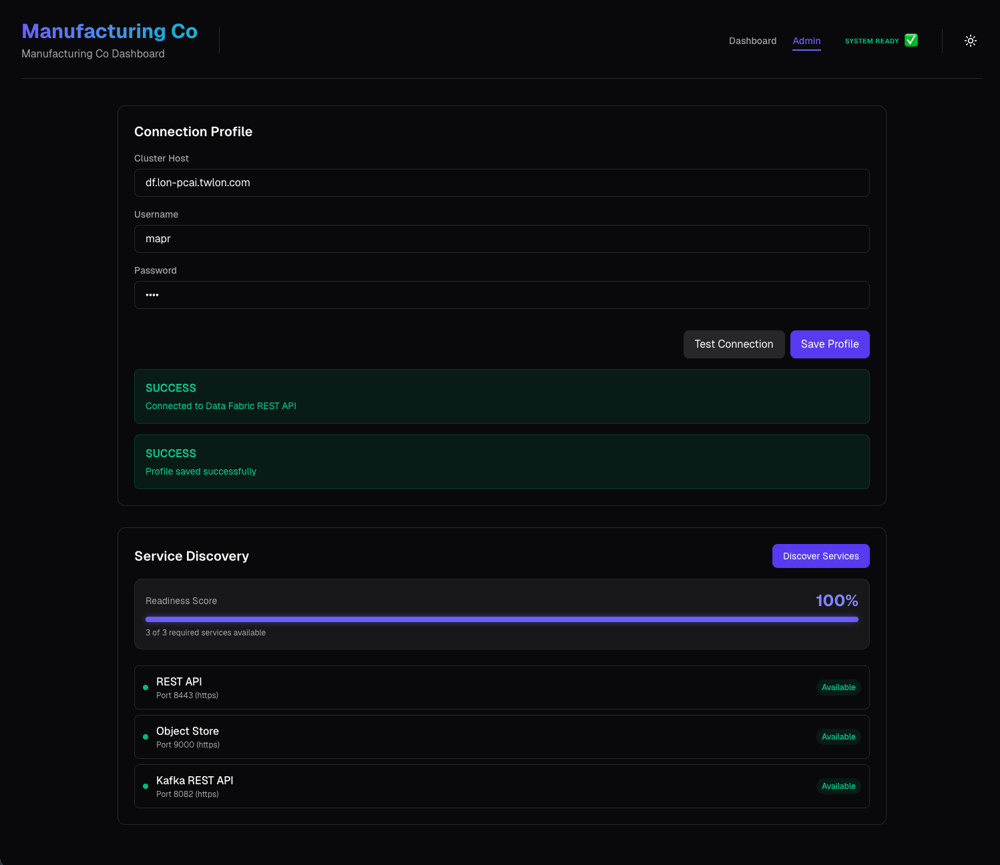
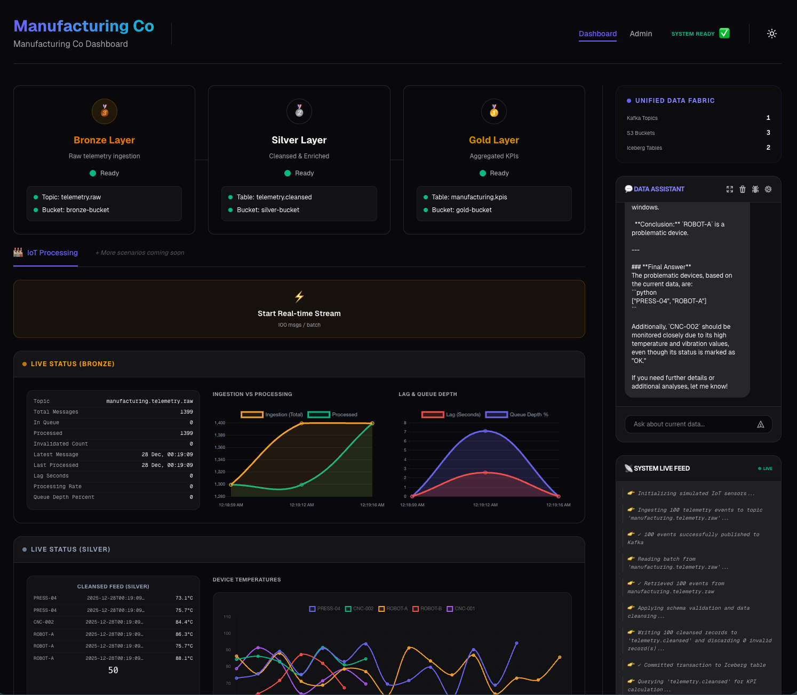

# Manufacturing Co Demo

This project uses HPE Data Fabric to demonstrate multi-format data lakehouse to build a Medallion architecture data flow for a fictional manufacturing company. Demo is built to be deployed on HPE Private Cloud AI platform and integrate with it's AI model serving endpoints via OpenAI API compatible chat interface, and utilizes the external HPE Data Fabric platform to create and use;

- `Kafka Topics` for streaming real-time data as part of the bronze layer (raw data), 

- `Iceberg Tables (stored in Silver bucket)` to keep track of cleaned up data as part of the silver layer (cleaned/processed data),

- `Iceberg Tables (stored in Gold bucket)` to consolidate curated data sets as part of the gold layer.

App enables user to process the entire data pipeline with a single click, which initiates the pipeline by publishing randomly generated 100 IOT device messages into the bronze layer topic, which in turn triggers processing and curating the data into higher layers in the architecture. 
Even though the app is not showing the entire data processing, it's outputs are visible in a "dashboard-like" interface similar to a real-time monitoring system for a production line.

Finally, integrated Chatbot engine send queries along with the context built in the app, including mocked IOT sensor data and processed/curated silver and gold layer data (respectively) to the AI model as part of the chat message. This demonstrates the value of integrated AI engine that would help with analyzing and recommending on active datasets totally within the organisation boundries, without sending any message, data or device information to external AI model providers.

A simple demonstration can be seen in the .

## Production Readiness

The codebase has been cleaned and containerized for production:

- **API**: Python 3.11 with `uv` for dependency management, running as non-root.
- **Web**: Next.js 15 with standalone output for minimal image size, running as non-root.
- **Helm**: A complete Helm chart is provided in `helm/manufacturing-co`.

## Deploy on PCAI

Use `Import Framework` wizard to deploy the application.

Use [logo](./manufacturing-co.jpeg) image for the logo, and [helm chart](./manufacturing-co-0.1.0.tgz) file as your package.

Once deployed, you should go to the "Admin" page and configure for your Data Fabric connection.

Data Fabric should have following services enabled/installed:

- REST API (port 8443) - installed by default, no need for manual configuration

- Object Storage (port 9000) - installed by default, no need for manual configuration (app will create temporary/short-lived s3 access_key and secret_key using REST API to connect, so your configured user should have access to that)

- Kafka REST API (port 8082) - Install mapr-kafka package if not already installed.

Follow the UI for full configuration:

- Test Connection (verify auth and enable connection profile)

- Save Profile (used by the app through its lifecycle, stored in PVC for persistance)

- Discover Services (check port availability and auth)



- Bootstrap resources (if missing app will enforce you to create them):
   
   - Create the S3 buckets and Kafka topics for each layer (bronze, silver and gold)

      - bronze-bucket
      - silver-bucket
      - gold-bucket

   - Create the Iceberg tables at each layer (telemetry.raw for bronze, telemetry.cleansed for silver and manufacturing.kpis for gold layer)

Once app shows "System Ready" on top header, you can navigate and create simulated data ingestion that will generate sample records (100 per run).



## Local Development (with Tilt)

```bash
tilt up
```

## Development Deployment (using Helm)

1. **Build and Push Images**:
   Build the images and push them to your registry.
   ```bash
   docker buildx build --platform linux/amd64 -t your-registry/backend:latest --push ./backend
   docker buildx build --platform linux/amd64 -t your-registry/frontend:latest --push ./frontend
   ```

2. **Configure values.yaml**:
   Update `helm/manufacturing-co/values.yaml` with your values.

3. **Install the Chart**:
   ```bash
   helm install manufacturing-co ./helm/manufacturing-co
   ```

## Project Structure

- `backend/`: Python FastAPI service.
- `frontend/`: Next.js frontend application.
- `helm/`: Kubernetes deployment configuration.
