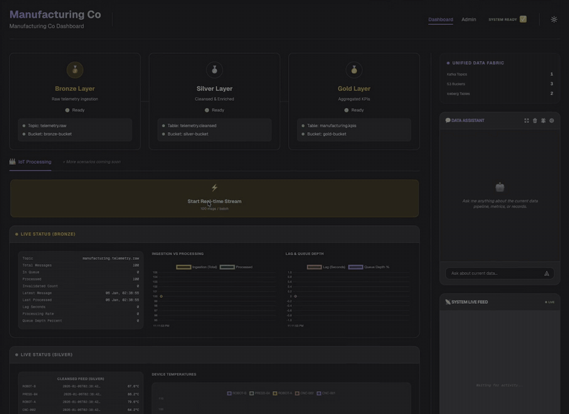
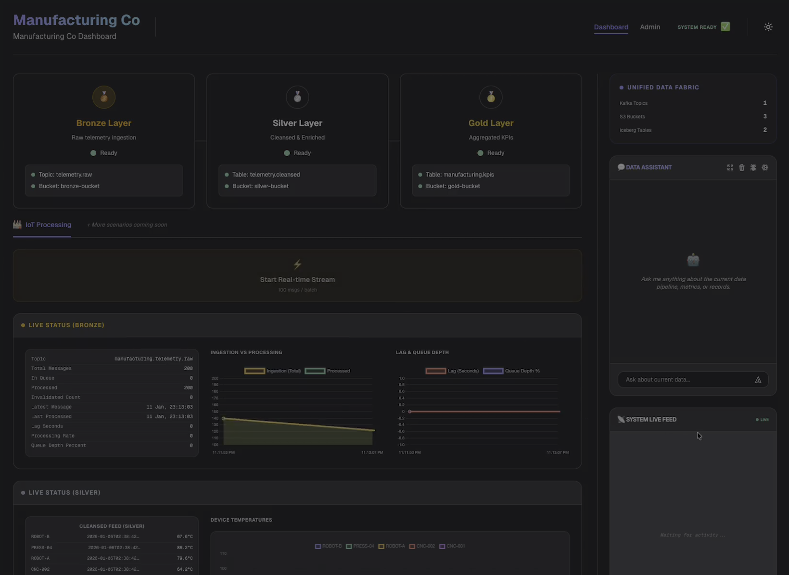
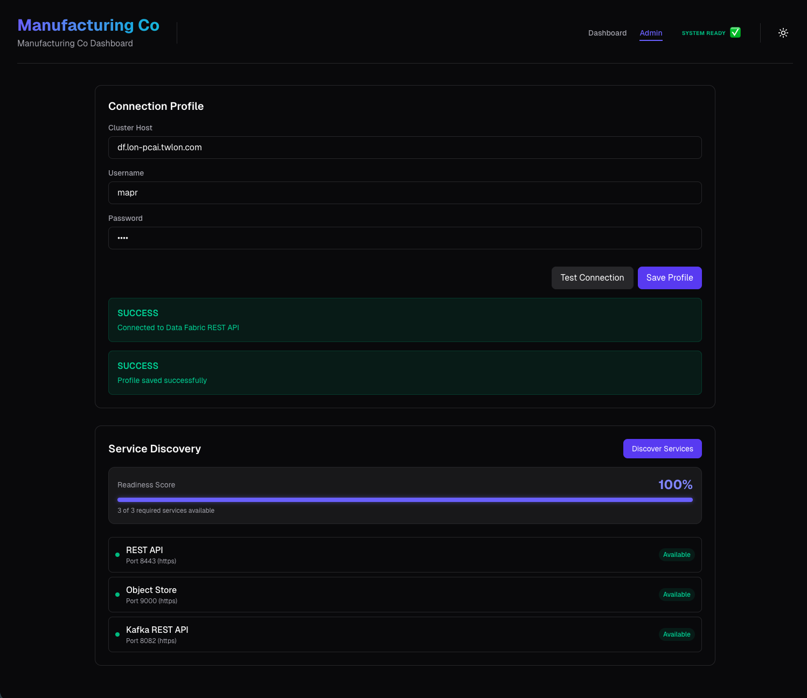

# Manufacturing Co — a medallion lakehouse with the AI kept inside

Factory telemetry is exactly the kind of data most organisations cannot paste into a
public AI service: it describes how the plant runs, who supplies it, and what is going
wrong. **Manufacturing Co** is a working demo of the alternative — a complete
bronze → silver → gold data pipeline for a fictional manufacturer, built on
[HPE Data Fabric](https://www.hpe.com/us/en/hpe-ezmeral-data-fabric.html), with an
assistant that answers questions about the live data while never leaving the
organisation's own boundary. One click runs the whole pipeline: 100 simulated IoT
readings are published to a stream, cleaned into an Iceberg table, aggregated into
KPIs, and rendered on a dashboard — and the same curated data is what the chat
assistant reasons over. It is aimed at data and infrastructure architects weighing up
a lakehouse design, and at anyone who needs to show that "AI on our own data" can mean
literally that.



<table>
<tr>
<td width="50%"></td>
<td width="50%"></td>
</tr>
<tr>
<td><em>Each layer reports its own table, bucket and readiness; the feed on the right narrates every step as it runs.</em></td>
<td><em>Admin: test the connection, save the profile, discover which services are actually reachable.</em></td>
</tr>
</table>

## The pipeline


```mermaid
flowchart LR
    iot["Simulated IoT devices<br/><i>100 readings per run</i>"]

    subgraph bronze ["BRONZE — raw"]
        topic["Kafka topic<br/><code>telemetry.raw</code>"]
        bb[("bronze-bucket")]
    end

    subgraph silver ["SILVER — cleansed"]
        st["Iceberg table<br/><code>telemetry.cleansed</code>"]
        sb[("silver-bucket")]
    end

    subgraph gold ["GOLD — curated"]
        gt["Iceberg table<br/><code>manufacturing.kpis</code>"]
        gb[("gold-bucket")]
    end

    dash["Dashboard"]
    ai["Assistant<br/><i>OpenAI-compatible endpoint</i>"]

    iot -->|publish| topic --> bb
    bb -->|"validate · discard invalid"| st --> sb
    sb -->|aggregate| gt --> gb
    bb --> dash
    sb --> dash
    gb --> dash
    dash -->|"question + current data as context"| ai

    classDef b fill:#fef3c7,stroke:#b45309,color:#451a03;
    classDef s fill:#f1f5f9,stroke:#475569,color:#0f172a;
    classDef g fill:#fef9c3,stroke:#a16207,color:#422006;
    class topic,bb b;
    class st,sb s;
    class gt,gb g;
    style bronze fill:#ffffff,stroke:#fcd34d,stroke-width:1px,color:#92400e;
    style silver fill:#ffffff,stroke:#cbd5e1,stroke-width:1px,color:#334155;
    style gold fill:#ffffff,stroke:#fde047,stroke-width:1px,color:#854d0e;
```

Nothing in that path leaves the cluster. The assistant receives the sensor readings and
the curated silver and gold rows as context in the prompt, and talks to a model endpoint
you nominate — so the analysis happens where the data already lives.

## What you need

- **An HPE Data Fabric cluster** with these services reachable:

  | Service | Port | Notes |
  |---|---|---|
  | REST API | 8443 | Installed by default |
  | Object store (S3) | 9000 | Installed by default. The app mints short-lived S3 keys through the REST API, so your user needs rights to do that |
  | Kafka REST API | 8082 | Install the `mapr-kafka` package if it is not already there |

- **A model endpoint** speaking the OpenAI chat API, for the assistant.
- A Kubernetes cluster to run the app itself.

## Deploy it

On [HPE Private Cloud AI](https://www.hpe.com/us/en/hpe-private-cloud-ai.html), use the
**Import Framework** wizard with the packaged chart
[`manufacturing-co-0.1.0.tgz`](./manufacturing-co-0.1.0.tgz) and
[`manufacturing-co.jpeg`](./manufacturing-co.jpeg) as the logo.

Anywhere else, install the chart directly:

```bash
helm install manufacturing-co ./helm/manufacturing-co \
  --set ezua.virtualService.endpoint=manufacturing.<YOUR_DOMAIN>
```

### First run

Everything else happens on the **Admin** page, in order:

1. **Test Connection** — verifies credentials and enables the connection profile.
2. **Save Profile** — persisted to a PVC, so it survives restarts.
3. **Discover Services** — checks each port and its authentication.
4. **Bootstrap resources** — creates what is missing:
   - buckets `bronze-bucket`, `silver-bucket`, `gold-bucket`
   - tables `telemetry.raw`, `telemetry.cleansed`, `manufacturing.kpis`

When the header reads **System Ready**, go to the dashboard and press
**Start Real-time Stream**. Each run generates 100 records and carries them through
every layer. Run it as many times as you like.

## Development

```bash
tilt up
```

Or build and push your own images and point the chart at them:

```bash
docker buildx build --platform linux/amd64 -t <registry>/manufacturing-backend:latest --push ./backend
docker buildx build --platform linux/amd64 -t <registry>/manufacturing-frontend:latest --push ./frontend
```

`./redeploy.sh` repackages the chart and reapplies it in one step.

## Layout

| Path | What |
|---|---|
| `backend/` | FastAPI service, Python 3.11, dependencies via `uv`, runs as non-root |
| `frontend/` | Next.js 15, standalone output, runs as non-root |
| `helm/` | Chart for both, plus ingress and auth policy |

A longer screen recording is in [`demo.mp4`](./demo.mp4).
